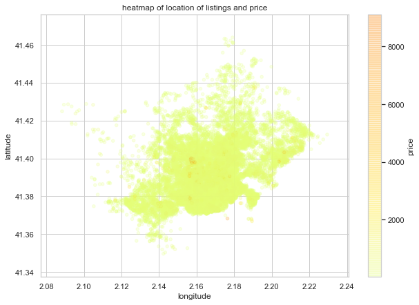
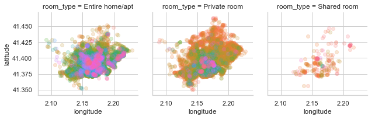
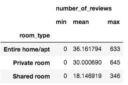

# AirBnB Barcelona

## Introduction
The first project on the <a href="https://www.udacity.com/course/data-scientist-nanodegree--nd025">Data Science Nanodegree by Udacity</a> consists of analysing a dataset using three initial questions to help the exploration. 

### Steps
The key steps for this project are:
1. Pick a dataset
2. Pose at least three questions related to business or real-world applications of how the data could be used.
3. Create a Jupyter Notebool to prepare, analyze, model and visualize the data.
4. Communicate business insights by creating a Github repository to share code and data wrangling techniques and a blog post to share the questions and insights to non-technical audience.

### The process
The process recommended on the course for this is  <a href="https://www.datasciencecentral.com/profiles/blogs/crisp-dm-a-standard-methodology-to-ensure-a-good-outcome">CRISP-DM</a>, which is an industry standard process for data mining:

* Business Understanding
* Data understanding
* Prepare Data
* Model Data
* Results
* Deploy

### Exploration questions
As part of this project and to help focus the analysis, there are three questions which I'll try to answer using the data avaiable:
1. Is the price affected by the location of the property?
2. Which locations receive the most reviews? What is the split between accomodation type and its reviews? What's the top reviewed property?
3. Can we predict the price by neighbourhood group?

## Quick overview of the content

<i>(TODO - Table of content)</i>

### Chosen Data set: Barcelona AirBnB provided on July 2019

I decided to choose the Barcelona <a href="http://insideairbnb.com/get-the-data.html">AirBnB dataset</a> (with the help of the course's menthor as I couldn't decide!) mainly because I lived there (quite a while ago) and it'd be a really interesting dataset which I could relate to.

### Files
* AirBnB-BCN-July2019Extract-Analysis jupyter notebook
* Data files

#### Data
I opted for creating a folder named "data" with all the different datasets downloaded from AirBnB (some in gz format):

* <b>calendar.csv</b>: which contains detailed calendar data for listings in Barcelona
* <b>listings.csv</b>: which contains summary information and metrics for listings in Barcelona (good for visualizations)
* <b>listings.csv.gz</b>: which contains detailed listings
* <b>neighbourhoods.csv</b>: which is a list of geo filter, sourced from city or open source GIS files
* <b>reviews.csv</b>: Summary Review data and Listing ID (to facilitate time based analytics and visualisations linked to a listing).
* <b>reviews.csv.gz</b>: Detailed Review Data for listings in Barcelona

## CRISP-DM on this dataset

#### Business Understanding
Ai‌r‌b‌n‌b‌, ‌ ‌I‌n‌c‌.‌ is an online marketplace for arranging or offering lodging, primarily homestays, or tourism experiences. The company does not own any of the real estate listings, nor does it host events; it acts as a broker, receiving commissions from each booking. <i>Extracted from <a href="https://en.wikipedia.org/wiki/Airbnb">Wikipedia</a></i>.

#### Data understanding
The datasets provided give an overview of the listings and their availability over a 12 month period (Jul 2019 to Jul 2020) as well as review data. For the review data we have to note that we don't have whether it's positive or negative, just the comment and the date. For this reason, I decided to use the following files to help with the analysis.

* Calendar (summary)
* Listings (summary)

These two files combined provide the price and availability for each of the properties. Also, the number of total reviews and the number of reviews per month for each property. 

#### Prepare Data
With any dataset, we need to explore to find areas where data is missing, incomplete or requires modification (such as data types). This also helps understand the data, what it contains and guide our exploration.

These key data processings were made:
* Convert string representing price to floats
* Split dates into months and years
* Remove NaNs: On this part, as a result of understanding the NaNs a particularity on prices showed up, where many listings would have "9999.0" as a price for a period of time. This could be due to a data bug or intentional action from hosts, however, given that they only represent 0.02% of all listings, I opted for removing them from the set.
* Renamed column "id" on Listings to "listing_id" to be able to "inner join" it with the calendar file.

After merging the listing and calendar file, we have a whole dataset with locations and prices for the whole year.

#### Model data
Let's recap on the questions which enable us to focus the analysis:
1. Is the price affected by the location of the property?
2. Which locations receive the most reviews? What is the split between accomodation type and its reviews? What's the top reviewed property?
3. Can we predict the price by neighbourhood group?

For case 1 we used simple techniques to explore the data, from plots, groupby and statistic correlations to show if location is related to the price of a listing.

For case 2, similar simple calculations to explore the data.

#### Results

> Is the price affected by the location of the property?

The answer is, yes, it is, though there are, of course, other factors to consider. However, just taking into consideration room type and location, the price seems to be higher the closer to the center we get.

- In 'Entire home/apt' the top 2 are Eixample and Sant Marti
- In 'Private Room' the top 2 are Eixample and Gracia
- In 'Shared room' the top 2 are Gracia and Sarria-SantGervasi, but it's worth noting that there are potential outliers on shared rooms that may be poluting the result

We obtained a negative correlation, funny enough, that suggest they are invertedly correlated but it suggests other factors need to be considered.

> Which locations receive the most reviews? What is the split between accomodation type and its reviews? What's the top reviewed property?

Both private rooms and entire homes tend to receive more reviews, almost double of those of shared rooms. On this dataset, the Entire homes has the highest number of reviews on average. 

The property with the highest number of reviews (645) is a Private room located in El Barri Gotic (Ciutat Vella) with an average price of $50. This listing receives on average 8.6 reviews per month.

> Can we predict the price by neighbourhood group?

Technically, we can, however it won't be too accurate as location is not one of the main contributors to price

### Deploy

## Installation
Anaconda, python 3.7, jupyter notebook extensions (to enable collapsible sections)
conda install -c conda-forge jupyter_nbextensions_configurator
