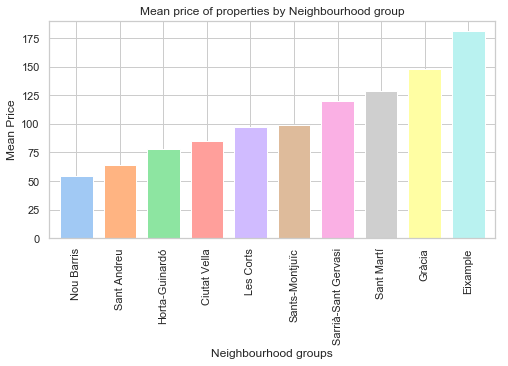

# AirBnB Barcelona
Ai‌r‌b‌n‌b‌, ‌ ‌I‌n‌c‌.‌ is an online marketplace for arranging or offering lodging, primarily homestays, or tourism experiences. The company does not own any of the real estate listings, nor does it host events; it acts as a broker, receiving commissions from each booking. <i>Extracted from <a href="https://en.wikipedia.org/wiki/Airbnb">Wikipedia</a></i>.

## Project Motivation

Using the recommended <a href="https://www.datasciencecentral.com/profiles/blogs/crisp-dm-a-standard-methodology-to-ensure-a-good-outcome">CRISP-DM</a> methodology on the <a href="https://www.udacity.com/course/data-scientist-nanodegree--nd025">Data Science Nanodegree by Udacity</a>, analyse the AirBnB Barcelona July 2019 dataset, focusing on the following 3 aspects:

1) Is the price affected by the location?
2) Which locations receive the most reviews? What is the split between accomodation type and its reviews? What's the top reviewed property?
3) Can we predict the mean price or avg reviews based on seasonality?

## Files

* <b>AirBnB-BCN-July2019Extract-Analysis</b> jupyter notebook.
* Data files contained within the "data" folder:
    * <b>calendar.csv</b>: which contains detailed calendar data for listings in Barcelona
    * <b>listings.csv</b>: which contains summary information and metrics for listings in Barcelona (good for visualizations)
    * <b>listings.csv.gz</b>: which contains detailed listings
    * <b>neighbourhoods.csv</b>: which is a list of geo filter, sourced from city or open source GIS files
    * <b>reviews.csv</b>: Summary Review data and Listing ID (to facilitate time based analytics and visualisations linked to a listing).
    * <b>reviews.csv.gz</b>: Detailed Review Data for listings in Barcelona

## Summary of findings:

### 1) Is the price affected by location?
Yes, it is. Looking at the mean price per neighbourhood group we can see that there are some locations which prices are higher than others:

This is also seen when plotted by phisical location:

Even when plotting by room type, we also observe certain areas which are "hotter" than others.

Being the top 2 locations: Eixample and Gracia.

### 2) Which locations receive the most reviews? What is the split between accomodation type and its reviews? What's the top reviewed property?

The top 3 most reviewed areas are Sants-Montjuic, Eixample and Gracia.

On average, entire homes recieve more reviews than other "room types". Having:

* 36 reviews on average per entire home
* 30 reviews on average per private room
* 18 reviews on average per shared room

The listing that has the most reviews is a Private room located in Ciutat Vella with a total of 645 reviews on the dataset, an average of 8 reviews per month and an average price of €50.

### 3) Can we predict the mean price or avg reviews based on seasonality?

## Installation
Anaconda, python 3.7, jupyter notebook extensions (to enable collapsible sections)
conda install -c conda-forge jupyter_nbextensions_configurator
